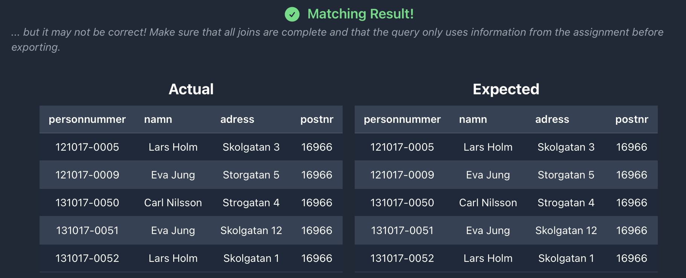
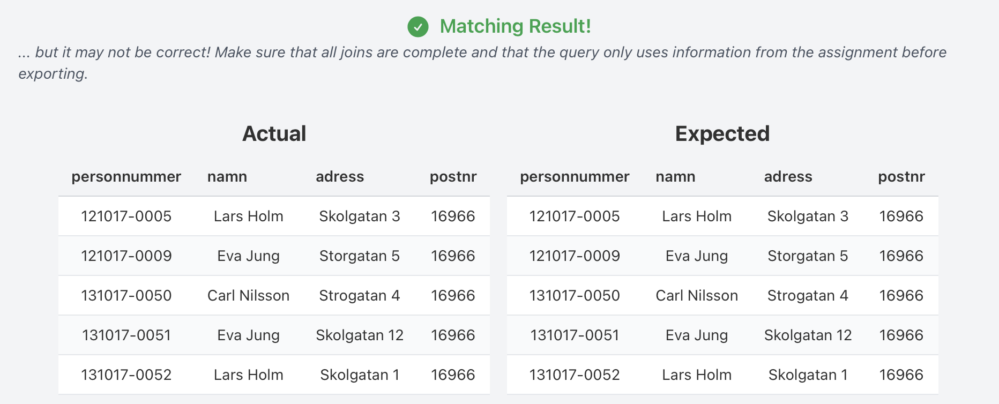
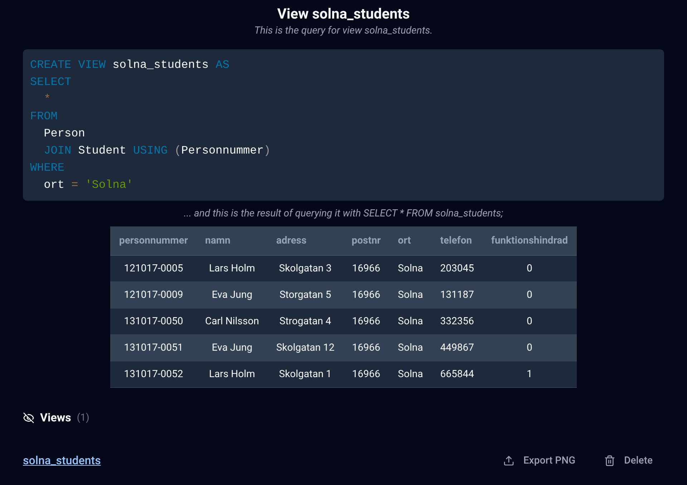
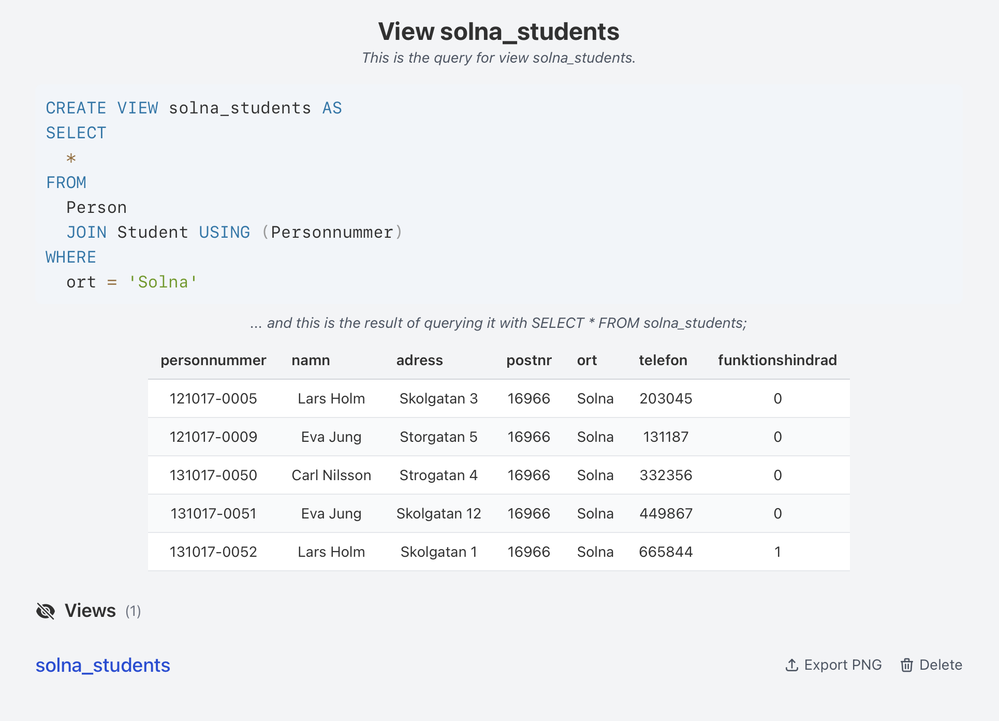
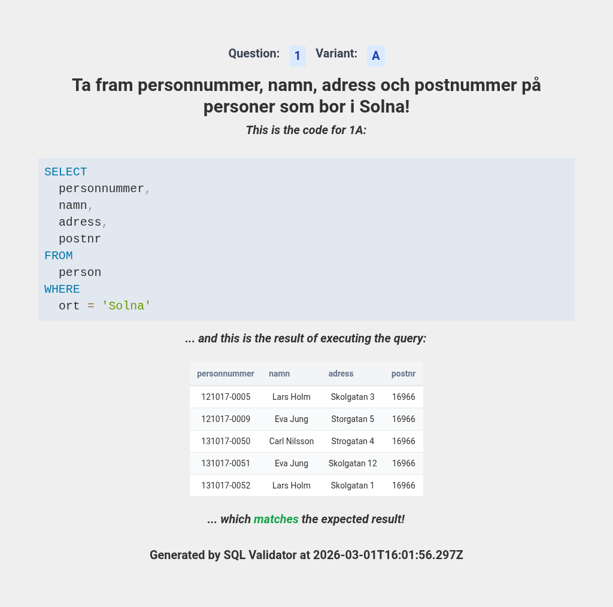
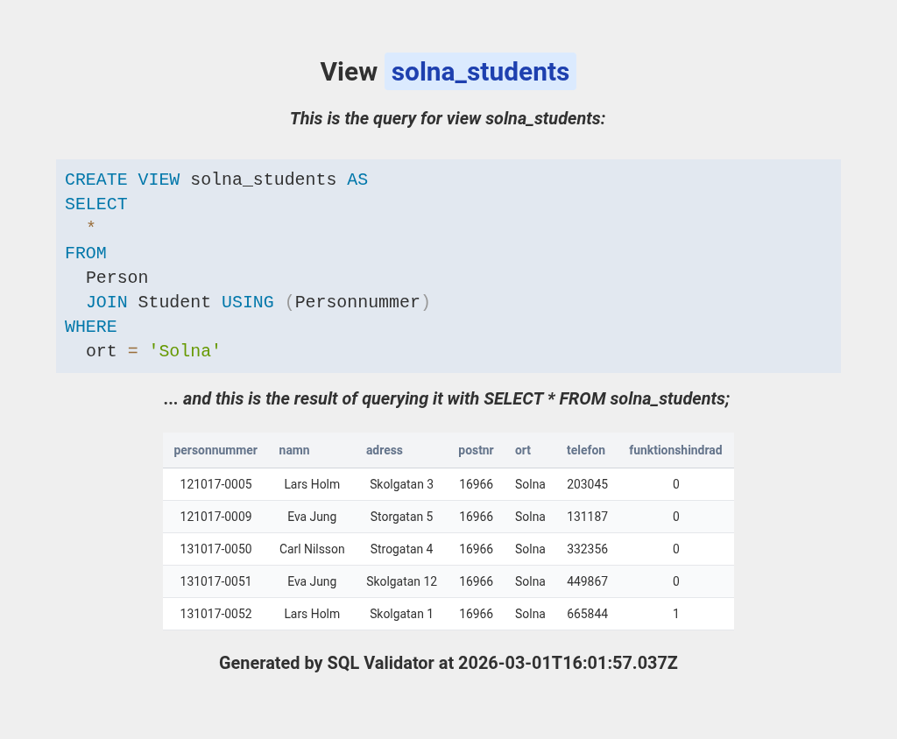

# SQL Validator
SQL Validator is a fully client/web side SQL client, editor and validator for practicing SQL. It runs an in-browser database (SQLite via sql.js or PostgreSQL via PGLite), so queries execute directly in the browser without a database server. You can write, format, and run queries, compare results against a built-in question bank, and create and manage views using the browser's local storage.

## Features
- **Fully Client-Side Execution**: All execution happens in the browser. Choose between SQLite (sql.js) and PostgreSQL (PGLite) per session; no backend required.
- **SQL & Relational Algebra**: Answer questions in SQL or relational algebra. RA expressions are converted to SQL and run the same way, with the generated SQL shown for reference.
- **Code Editor**: CodeMirror editor with syntax highlighting, formatting, and autocomplete for table and column names.
- **Views Management**: Create, delete, and manage database views, stored in the browser's local storage.
- **Efficient Results Comparison**: Compare query results to expected results based on a question bank.
- **Dark/Light Mode**: Toggle between dark and light mode.
- **Question Highlighting**: Started and completed questions are highlighted in the question selector making it easy to track progress.
- **Import/Export Data**: Import and export queries and views to file for sharing and/or backups.
- **Image Export**: Export queries and views as images in light mode for assignment submission.
- **Multi-Language Support**: Full i18n support with Swedish, English, and German included. Adding a new language takes a language pack file plus a registry entry.

## Usage
### Public Deployment
A public instance of SQL Validator is available at [https://sql-validator.e-su.se](https://sql-validator.e-su.se), powered with Cloudflare Pages.

### Running Locally
1. Clone the repository: `git clone https://github.com/Edwinexd/sql-validator.git`
2. Install dependencies: `npm install`
3. Start the development server: `npm start`

## Architecture
### Oracle System
The **oracle** (`data/oracle.json`) is the single source of truth for the database schema, canonical data, and all 110 reference SQL queries. It uses language-agnostic placeholders (e.g. `{{table:Person}}`, `{{col:Person.city}}`, `{{city:6}}`) that are resolved at generation time using a language pack.

The oracle is encrypted (`data/oracle.enc`) before committing so students cannot see the answers.

### Language Packs
Language definitions live in `languages/` (e.g. `sv.ts`, `en.ts`, `de.ts`), and the app's language menu is driven by the registry in `src/i18n/languages.ts`. Each pack provides:
- Localized names, addresses, cities, course names, room names
- Per-person IDs, postal codes, phone numbers
- Schema translations (table and column names)
- 110 localized question descriptions
- UI strings

### Generation Pipeline
The `generate-language.ts` script combines the oracle with a language pack to produce per-language output for both database engines:
1. Builds a localized database for each engine: SQLite (via sql.js) and PostgreSQL (via PGLite)
2. Runs all reference queries to produce expected result sets
3. Outputs `questionpool.json` + `data.sqlite3` into `public/languages/<code>/` (SQLite) and `questionpool.json` + `data.sql` into `public/languages/<code>-pg/` (PostgreSQL)

The `generate-erd.ts` script produces light/dark SVG database diagrams from the generated databases.

Both scripts support `--all` to auto-discover and process all languages.

### Scripts
| Script | Description |
|---|---|
| `npm run generate-all` | Regenerate all languages (question pools, databases, ERDs) |
| `npm run generate-lang -- --lang <code> --plain` | Generate a single language using unencrypted oracle |
| `npm run generate-lang -- --all --plain` | Generate all languages |
| `npm run generate-erd -- --all` | Regenerate ERD diagrams for all languages |
| `npm run encrypt-oracle -- <password>` | Encrypt `oracle.json` to `oracle.enc` |
| `npm run decrypt-oracle -- <password>` | Decrypt `oracle.enc` to `oracle.json` |

### Adding a New Language
1. Create a new file in `languages/` (e.g. `fr.ts`) implementing the `LanguageDefinition` interface
2. Register it in `src/i18n/languages.ts` (`AVAILABLE_LANGUAGES`)
3. Run `npm run generate-all`

## Screenshots
## Main Application

    
    

    
    

    
    

## Views

    
    

## Image Exports

    
    

## License
This project is licensed under the GNU General Public License v3.0. See the [LICENSE](LICENSE.md) file for more information.
